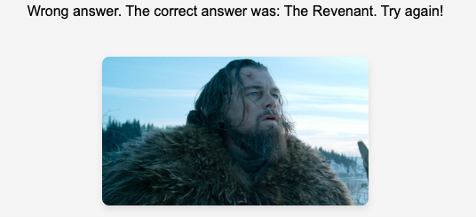
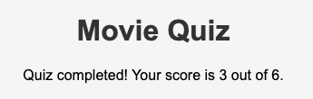
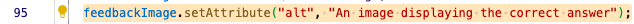

# Movie Quiz 

Movie Quiz is a site that uses HTML, CSS and JavaScript. It´s a responsive game/quiz for people that loves movie trivia. The user will be presented with 6 questions and in the end of the quiz you will be presented with your final score. 

# Features

* Header: Featured at the top of the page, the Movie Quiz heading is easy to see for the user. Upon viewing the page, the user will be able to see the name of the game.

* The game area: The user will get a question, and then choose from 4 different answers. After the answer is submitted, the user will be presented with the next question, and ultimately the final score of the quiz. 

* The feedback-area: This area shows the user if the answer was right or wrong. It also provides an image containing the correct answer.

* Score-area: This section (the final part of the quiz) shows the users final score. 

# Validator testing

* HTML: The HTML code has one error that I am well aware of: 
- (Error: An img element must have an alt attribute, except under certain conditions. For details, consult guidance on providing text alternatives for images)

- This caused an unwanted alt-text that was displayed between the answers. I found that the best way to resolve this (after many attempts to alter the html code) was to add the following code on line 95 in the javascript instead:

* CSS - No errors were found when passing through the official (Jigsaw) validator

* JavaScript - No errors were found when passing through the official Jshint validator
- The following metrics were returned:
- There are 6 functions in this file.
- Function with the largest signature take 1 arguments, while the median is 1.
- Largest function has 17 statements in it, while the median is 8.5.
- The most complex function has a cyclomatic complexity value of 2 while the median is 1.5.

# Unfixed bugs

* The previously mentioned problem with the alt-text in the html code. Since the game works they way it was designed, I decided to leave this bug due to lack of understanding/knowledge how to resolve it. 

# Deployment

* The site was deployed to GitHub pages. The steps to deploy are as follows:
* In the GitHub repository, navigate to the Settings tab.
* Qlick settings, then pages.
* Choose main branch and save. 

The live link can be found here - https://tobiaschristophe.github.io/quiz-game/

# Credits

## Content 
* I used the readme from Code Institute (I love maths) as a template when wrighting this one. 
* I made the game area 75% (this was shown in an instructional video from Code Institute before starting this project)

## Media
* All the images are from google. 

