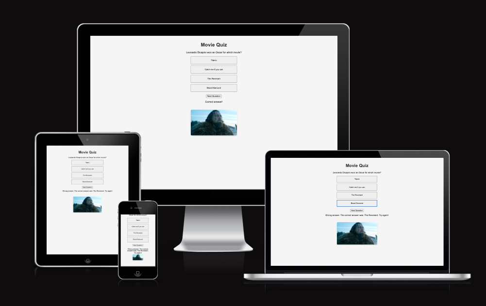
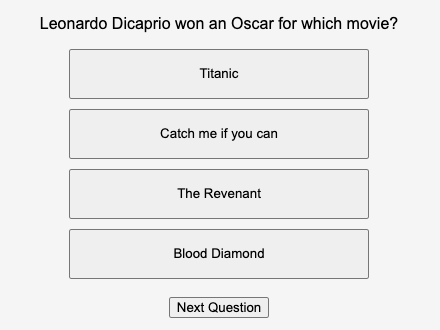

#Movie Quiz 

Movie Quiz is a site that uses HTML, CSS and JavaScript. It´s a responsive game/quiz for people that loves movie trivia. The user will be presented with 6 questions and in the end of the quiz you will be presented with your final score. 

#Features

* Header
- Featured at the top of the page, the Movie Quiz heading is easy to see for the user. Upon viewing the page, the user will be able to see the name of the game.

* The game area
- The user will get a question, and then choose from 4 different answers. 
- After the answer is submitted, the user will be presented with the next question, and ultimately the final score of the quiz. 

